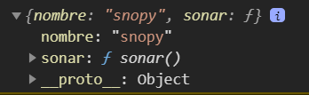

# Curso Jhon Mircha Javascript


# Clase 21 Arrow Functions

Recordemos cual es la diferencia entre funcion **expresada** y **declarada**

- **expresada:** la que se asigna a una variable.
  
```js
const saludo= function ()
{
    console.log("Hola");
}
```

- **Declarada:** La función tiene un nombre y por tanto se puede invocar mediante ella. Una ventaja de esta es que puede ser invocada antes de ser  escrita, cosa que con la expresada no, ya que la función esta asociada a una variable y esta solo existe  cuando se declara.
  - Al proceso por el cual el interprete de javascript cambia el orden, haciendo que  internamente la funcon este declara antes de ser invocada , aunque yo lo haya escrito al revés , se le conoce como **hoisting (levantado)**

Ejemplo

```js
funcition saludar()
{
    console.log("Hola");
}
```

## Arrow function

Es una nueva manera de declarar funciones, aunque con su implementación cambia el scope.

```js
const saludar=()=>
{
    console.log("Hola");
}
saludar()
```

Ahora, si tu función tiene una sola linea puedes omitir las llaves,

```js
const saludar=()=> console.log("Hola");
```

Otra cosa muy cool de las arrow fuctions , es que tienen un `return` implicito si se hace de una sola linea.

```js
suma=(a,b)=> return a+b;
console.log(suma(1+2))
```

en cosola:

> 3

## El contexto en las arrow fuctions

El contexto cambia en las arrow fuctions, ya que si por ejemplo crearmaos un objeto  y dentro de el declaramos una funcion y dentro de ella escribieramos `console.log(${this})` el resultado es diferente de una con arrow fuction donde imprimiría el objeto contenedor  de donde se encuentra el objeto  es decir **window**
, sin embargo , si lo hacemos usando una funcion corriente mostraía el **objeto**

### Ejemplo 

**código**

```js
//t22-1.html
function perro()
{
    console.log(this)
}
const perro2={
    nombre:"Kenai",
    ladrar:function()
    {
        console.log(this);
    }
}
const perro3={
    nombre:"Kenai",
    ladrar:()=>
    {
        console.log(this);
    }
}
perro()
perro2.ladrar()
perro3.ladrar()
```


**Conslusiones:**

A donde apunta, si dentro ejecutamos un `this`

- funcioón flecha--> padre del contenedor
- funcion normal --> objeto windows
- funcion dentro del objeto--> objeto


# Recorramos un arreglo con Foreach

a este método de lo arreglos se le tienen que pasar una función, que ademas a dicha función se le pueden pasar dos varibales a1, a2

- a1 --> el elemento del arreglo
- a2 --> el indice del elemento del arreglo

**Estructura con forEach**

```js
arreglo.forEach(fuction(a1,a2)
{
    codigo
})
```

# Ejemplo

vamos a recorre un arreglo con 5 elementos, 1 usando una funcion normal , 2 usando una función flecha

**Codigo**

```js
const numeros=[1,2,3,4,5]
numeros.forEach(function(elemento,index)
{
    console.log(`${elemento} en la posición ${index}`)
})
numeros.forEach((e,i)=>
{
    console.log(`${e} en la posición ${i}`)

})
```

**Resultado**


---

# Clase 22 Prototipos

 Primero tenemos que introducirnos en teória para poder explicar el orientado a objetos y sus variantes.

 - Javascript es un un lenguaje de Programación Orientada en Prototipos (POP), no en Programación Orientada en Objetos (POO).
 - Existen similitudes entre ambos enfoques, comparten conceptos  POP y POO, que son **atributos,métodos**

**Métodos:** Son funciones que se encuentran dentro del objeto.
**Atribustos:** Son variables que se encuentran en el objeto.

```js
//t23-1.html
const animal= {
    nombre:"snopy",
    sonar(){
        console.log(`Gua gua`)
    }
}
console.log(animal)
```



- En la anteiror imagne se puede apreciar que el **objeto literal**  es un prototipo de **objeto**.
- Posee una función y un atributo

```js
const perro1={
            nombre:"firulais",
            ladrar(){
                console.log("Gua Gua")
            }
        }
        const perro2={
            nombre:"fido",
            ladrar(){
                console.log("Gua Gua")
            }
        }

        function Perru(nombre)
        {
            this.nombre=nombre
            this.ladrar=function()
            {
                console.log("gua gua")
            }
        }

        const pelusa=new Perru("Pelusa"),
        pelusa2=new Perru("Pelusa2")

        console.log(perro1)
        console.log(perro2)
        console.log(pelusa)
        console.log(pelusa2)
```


**Resultado**


- Todos son objetos , solo que los primeros literamente son sólo objetos (objetos literales), los dos siguientes dicen que son instancias  de algo llamado **Perru** es algo aproximado a una clase.
- Todas "heredad" (No es exacatamente herencia) del prototipo fundamental (object)

Esta manera de lograr implementar "clases" es buena, pero en todos los objetos **Perru** se repite el método **ladrar** lo que es ineficiente, ya por ejemplo otros métoos que se pueden hacer provienen directamente del **_proto_:object** y no se repiten para todos los objetos de la misma "clase".

para mejorarlo ló unico que hacemos es asignarle el método a la función protoipo en ves de a la clase pasando de esto:

```js
function PerruV1(nombre)
{
    this.nombre=nombre
    this.ladrar=function()
    {
        console.log("gua gua")
    }
}
```

a estos
```js
function PerruV2(nombre)
{
    this.nombre=nombre
}
PerruV2.prototype.ladrar=function()
{
    console.log("gua gua")
}
```

**Conclusiones**
- Podemos usar este intento de clases para construir objetos con los mismas caracteristicas  pero con diferntes valores, en cambio usando (objetos literales) tienes que copiar la misma estructura para crear objetos identicos.

vemaos como queda el **PerruV1** vs **PerruV2** implementando en el sigueinte código

```js
//t23-3.html
function PerruV1(nombre)
{
    this.nombre=nombre
    this.ladrar=function()
    {
        console.log("gua gua")
    }
}
function PerruV2(nombre)
{
    this.nombre=nombre
}
PerruV2.prototype.ladrar=function()
{
    console.log("gua gua")
}

const fido1=new PerruV1("fido"),
fido2=new PerruV2("fido2")
console.log(fido1)
console.log(fido2)
```

**Resultado**


Observamos , mientras que la version 1 se va duplicar las funciones en todos los objetos, en la verison 2 solo exisitira una vez el método y todos lo aplicaran.

La mejor manera de tener una imagen mental de esto es, piensa que haces galletas y que el molde te salio mal y tienes que arreglar manualmente ese error , o  la otra manera es corrigiendo el molde y que todo ya salga hecho a la medida

## Clases

Piensa que tu eres un pastelero y quieres hacer una galleta, okey, aplanas la masa , le das forma circular y la metes al horno. Genial pruebas la galleta y te quedó deliciosa.

Ahora tu quieres hacer más , pero hacerla  como hiciste la primera te tardaria mucho y es posible que no te quedaran precisamente parecidas, la masa se escurre y en un descuido no sería circula.

Que tal si tuiveramos un molde y con ello solo virtieramos y sale la forma lista para el horno. ¿ Sería más rapido y preciso no?
¿y si quisieramos cambiar el sabor? Se podría , el molde sólo da forma, pero no lo que lo compone.

Esto que en el ejemplo llamamos **molde** no es más que algo que le da estructura a un objeto, podrían ser por jeemplo personas, describiendo estatura, nombre, edad y pues seria más fácil usando estos moldes, unicamente cambiando las caracteristicas.

# Clase 23

https://www.youtube.com/watch?v=1-m7xtwvH1E&list=PLvq-jIkSeTUZ6QgYYO3MwG9EMqC-KoLXA&index=23